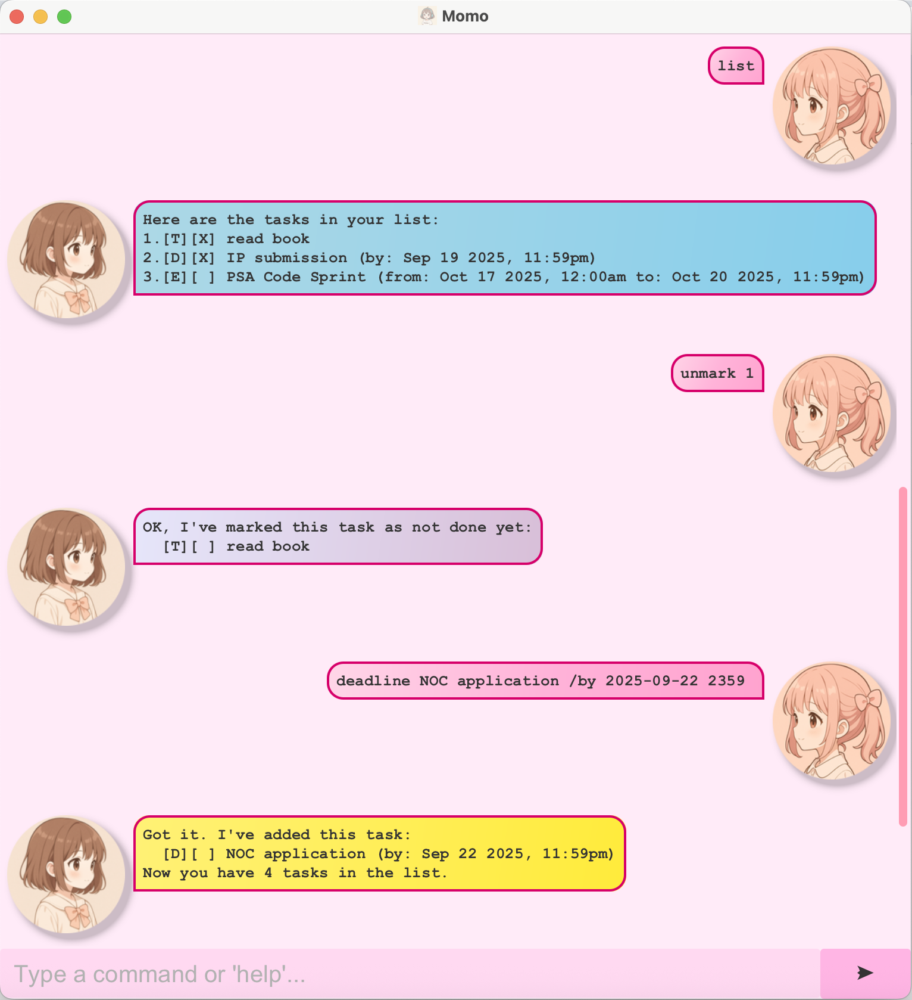

# Momo User Guide



Momo is a **command-line based task manager** that helps you organize your todos, deadlines, and events efficiently. You can quickly add, track, and manage tasks using simple commands.

---

## Adding Todos

Use the `todo` command to add simple tasks without a specific date or time.

**Format:**
`todo <description>`

**Example:**
`todo read chapter 1 of textbook`

**Expected Output:**

```
Got it. I've added this task:
  [T][ ] read chapter 1 of textbook
Now you have 1 tasks in the list.
```

---

## Adding Deadlines

Use the `deadline` command to add tasks with a due date.

**Format:**
`deadline <description> /by <yyyy-MM-dd HHmm>`

**Example:**
`deadline CS2103T Assignment /by 2025-09-25 2359`

**Expected Output:**

```
Got it. I've added this task:
  [D][ ] CS2103T Assignment (by: Sep 25 2025, 11:59pm)
Now you have 2 tasks in the list.
```

---

## Adding Events

Use the `event` command to add tasks that occur within a specific time frame.

**Format:**
`event <description> /from <yyyy-MM-dd HHmm> /to <yyyy-MM-dd HHmm>`

**Example:**
`event hackathon /from 2025-09-20 0900 /to 2025-09-21 1800`

**Expected Output:**

```
Got it. I've added this task:
  [E][ ] hackathon (from: Sep 20 2025, 9:00am to: Sep 21 2025, 6:00pm)
Now you have 3 tasks in the list.
```

---

## Listing Tasks

Use the `list` command to display all tasks in your current task list.

**Format:**
`list`

**Example:**
`list`

**Expected Output:**

```
Here are the tasks in your list:
1.[T][ ] read chapter 1 of textbook
2.[D][ ] CS2103T Assignment (by: Sep 25 2025, 11:59pm)
3.[E][ ] hackathon (from: Sep 20 2025, 9:00am to: Sep 21 2025, 6:00pm)
```

---

## Marking Tasks as Done

Use the `mark` command to mark a task as completed.

**Format:**
`mark <task number>`

**Example:**
`mark 2`

**Expected Output:**

```
Nice! I've marked this task as done:
  [D][X] CS2103T Assignment (by: Sep 25 2025, 11:59pm)
```

---

## Unmarking Tasks

Use the `unmark` command to mark a task as not done.

**Format:**
`unmark <task number>`

**Example:**
`unmark 2`

**Expected Output:**

```
OK, I've marked this task as not done yet:
  [D][ ] CS2103T Assignment (by: Sep 25 2025, 11:59pm)
```

---

## Deleting Tasks

Use the `delete` command to remove a task from your list.

**Format:**
`delete <task number>`

**Example:**
`delete 3`

**Expected Output:**

```
Noted. I've removed this task:
  [E][ ] hackathon (from: Sep 20 2025, 9:00am to: Sep 21 2025, 6:00pm)
Now you have 2 tasks in the list.
```

---

## Finding Tasks

Use the `find` command to search for tasks containing a specific keyword.

**Format:**
`find <keyword>`

**Example:**
`find Assignment`

**Expected Output:**

```
Here are the matching tasks in your list:
1.[D][ ] CS2103T Assignment (by: Sep 25 2025, 11:59pm)
```

_Note: The `find` command is **case-sensitive**. e.g. `assignment` will not match `Assignment`_

---


## Help

Use the `help` command to display a list of available commands and usage instructions.

**Format:**
`help`

**Example:**
`help`

**Expected Output:**

```
Here are the available commands:
1.list                  - Show all tasks
2.todo <description>    - Add a todo task
3.deadline <description> /by <yyyy-MM-dd HHmm> - Add a deadline
4.event <description> /from <yyyy-MM-dd HHmm> /to <yyyy-MM-dd HHmm> - Add an event
5.mark <task number>    - Mark a task as done
6.unmark <task number>  - Mark a task as not done
7.delete <task number>  - Delete a task
8.find <keyword>        - Find tasks containing the keyword
9.help                  - Show this help message
10.bye                  - Exit the application
```

---

## Exiting Momo

Use the `bye` command to exit the application.

**Format:**
`bye`

**Example:**
`bye`

**Expected Output:**

```
Bye. Hope to see you again soon!
```

_Note: The "Bye. Hope to see you again soon!" message is generally not shown. In rare cases, such as on very slow systems, it may appear briefly._
